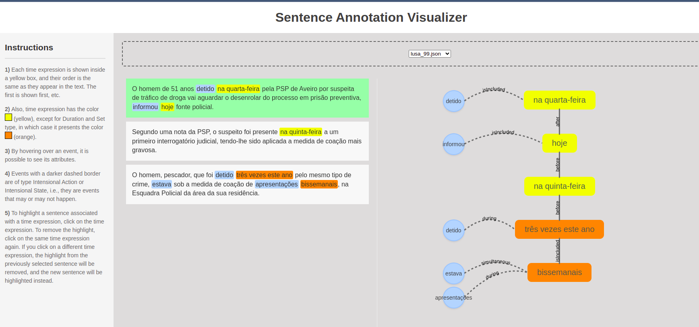

# sentencevisual

This is a web application devoted to visualize annotation from sentences. The main goal is of this application is to 
visualize the relations between two different entities' types. In future versions, we hope to include other entities 
than events and times.  

Current, there are two versions. The first, it is the visualization of sentences with events and time expressions, 
and connection between them. Next, we detail the input format for the visualization, and the visualizations modes.


## JSON Format

This visualization is supposed to visualize events and time expressions. In the future, we hope that this visualization 
aids other entities' type. Thus, to aid annotation process. 

The Json should have a list of sentences, like this:

```json
{
  "sentences": [
    {
      "text_sent": "...",
      "sent_id": "...",
      "events": [
        {
            "text_event": "...",
            "event_id": "...",
             "...."
        }
      ],
      "times": [
        {
            "text_time": "...",
            "time_id": "...",
             "...."
        }
      ],
      "out_sent_times": [
        {
            "text_time": "...",
            "time_id": "...",
             "...."
        }
      ]
    }
  ]
}

```

All the fields presented in the above draft are mandatory, namely:
`text_sent` (it should contain the text of the sentence), `sent_id` (it is an unique identifier for 
the sentence) ,`events` (it is a list of events, each with an unique id and text), `times`(it is a list of times 
expressions, each with an unique id and text) and `ref_times` ((it is a list of times , each with an unique id and text)). 





